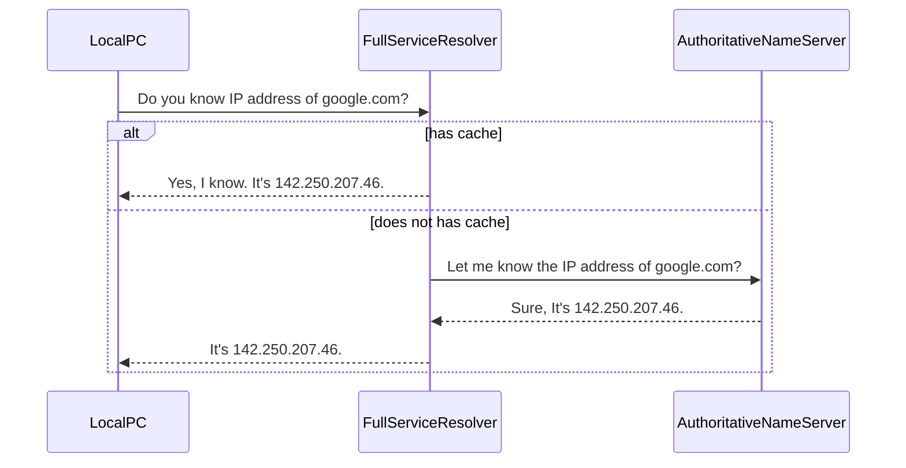

---
aliases:
  - DNS
  - DNSサーバー
---
- [[IPアドレス]]の[[名前解決]]の仕組み
- DNSサーバーに対してリクエストを送ることでIPアドレスを返す
- 家庭用ネットワークの場合、ルーターは通常、[[Internet Service Provider|ISP]]から指定されたDNSサーバーを使用する

Authoritative name server