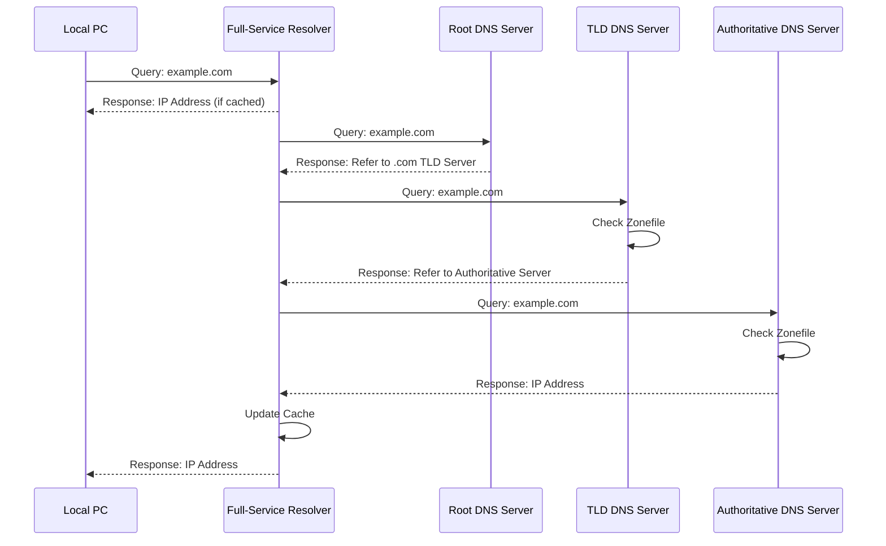

---
aliases:
  - DNS
  - DNSサーバー
---
- [[IPアドレス]]の[[名前解決]]の仕組み
- DNSサーバーに対してリクエストを送ることでIPアドレスを返す
	- フルサービスリゾルバ（DNSキャッシュサーバー）
	- 権威DNSサーバー(DNSコンテンツサーバー、AuthoritativeNameServer)
		- DNSルートサーバー：フルサービスリゾルバが最初に問い合わせる先
		- TLD DNS サーバー：`.com`, `.org`, `.jp`といったtop level domainに関する情報を持ったサーバー
	- ゾーンファイル：権威DNSサーバーが管理する範囲（ゾーン）内のIPアドレスとドメイン名の対応、委託先のDNSサーバーの情報などが記載されたファイル。
- 家庭用ネットワークの場合、ルーターは通常、[[Internet Service Provider|ISP]]から指定されたフルサービスリゾルバを使用する



- ゾーンファイル
	- DNSレコード：各行に書かれた設定。
		- SOAレコード: ゾーンに関する情報が書かれたレコード
		- [[NSレコード]]: 管理を委託しているDNSサーバーの名前が書かれたレコード
		- MXレコード: そのドメイン宛のメールの配送先メールサーバーが書かれたレコード
		- Aレコード: ドメイン名に対応するIPアドレス（IPv4）が書かれたレコード
		- CNAMEレコード: ドメイン名につけた別名が書かれたレコード
	- INは==In==ternetのこと
```text
$TTL    86400  
@     IN SOA ns1.example.com. postmaster.example.com. (  
        2014033101  
        10800  
        3600  
        604800  
        86400 )  
  
; name server
        IN NS         ns1.example.com.  
        IN NS         ns2.example.com.  
  
; mail server  
        IN MX 10     mail.example.com.  
  
; IP Address  
        IN A            198.51.100.2  
ns1     IN A            198.51.100.2  
www     IN A            198.51.100.2  
mail    IN A            198.51.100.2  
hoge    IN A            198.51.100.2  
  
sub    IN CNAME        hoge
```

