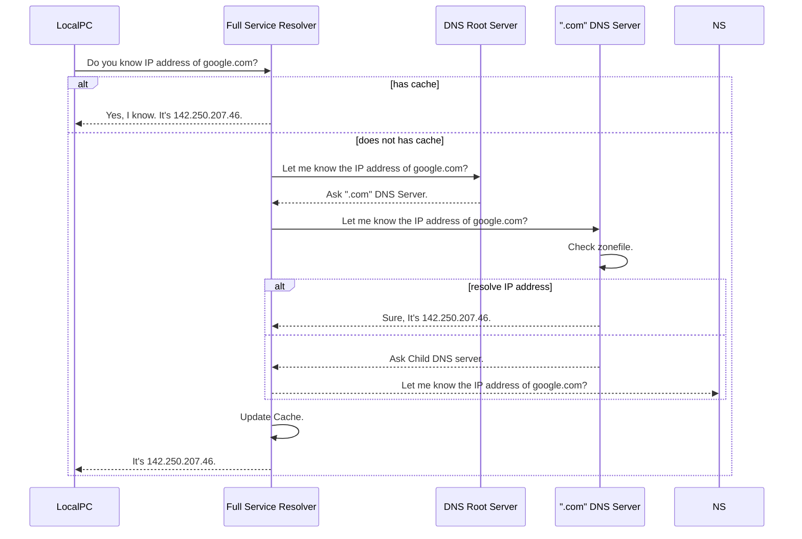

---
aliases:
  - DNS
  - DNSサーバー
---
- [[IPアドレス]]の[[名前解決]]の仕組み
- DNSサーバーに対してリクエストを送ることでIPアドレスを返す
	- フルサービスリゾルバ（DNSキャッシュサーバー）
	- 権威DNSサーバー(DNSコンテンツサーバー、AuthoritativeNameServer)
		- DNSルートサーバー：フルサービスリゾルバが最初に問い合わせる先
- 家庭用ネットワークの場合、ルーターは通常、[[Internet Service Provider|ISP]]から指定されたフルサービスリゾルバを使用する

