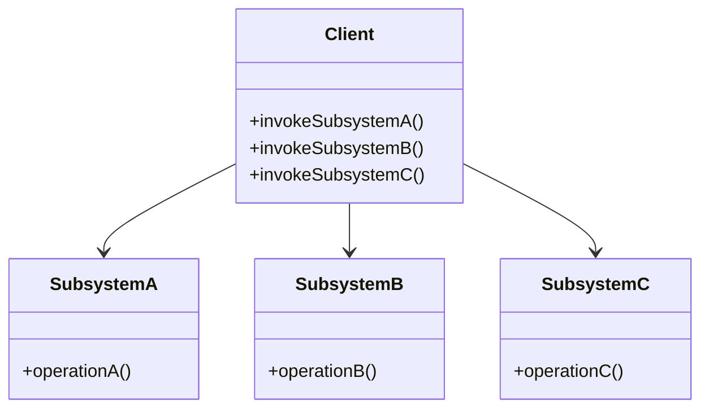
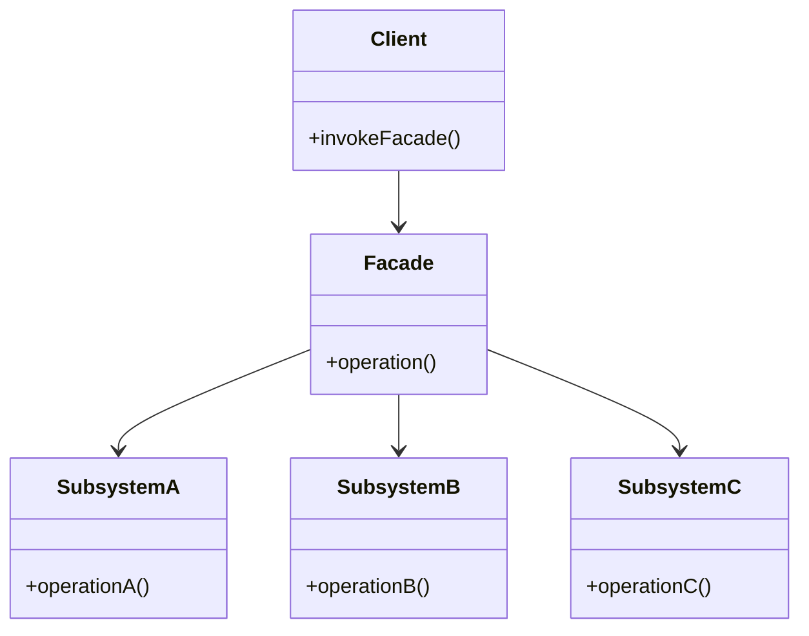

---
tags:
  - デザインパターン
aliases:
  - ファサードパターン
  - Facade
---
高度なライブラリやフレームワークに属する広範なオブジェクトを自分のコードに組み込む際にそのまま実装すると、自分のコード中のクラスのビジネスロジックと外部のクラスの実装の詳細が密結合になってしまう。

Facadeが仲介に入り、サブシステムの詳細を隠蔽し、単純なインターフェースをクライアントに提供することで、ビジネスロジックとライブラリの詳細を分離することができる。

ファサードとは建築用語で「建物の正面」や「外観」を意味する
