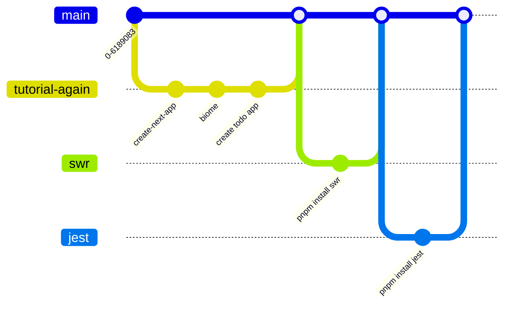

## 知りたいこと
- next.jsについて、ディレクトリ構造を理解してどこに何を追加するのか理解する
- 一通りわからないことがないくらいになりたい。
- Next.js中級者
## 今回は勉強しないこと（別の機会にすること）
- [[React Server Component|RSC]]
- レンダリングストラテジー（静的、動的、Streaming）
### 実装戦略
### 前提
- pages router
- chakra ui
- swr
- typescript
- biome
### ステップ
- **ステップ1: TypeScriptとNext.jsの連携、およびBiomeの導入（1〜2週間）**
  - **目標**: TypeScriptを用いてNext.jsの基本機能を実装し、Biomeを導入してコード品質を管理する。
  - **具体的なアクション**:
    - Next.jsの公式ドキュメントを参照し、TypeScript環境の設定方法を学ぶ。
    - 小規模なプロジェクト（例えばTodoアプリやブログ）をTypeScriptで構築し、型定義やPropsの型指定、カスタムフックの作成などを実践する。
    - **Biome**をプロジェクトに導入し、コードフォーマットとLintingの設定を行う。これにより、コードの整合性と品質を一貫して維持できるようにする。
    - Biomeの設定を使って、プロジェクトのコードスタイルを自動化し、TypeScriptとNext.jsに適したLintingルールを適用する。

- **ステップ2: 実践的なプロジェクト構築（3〜4週間）**
  - **目標**: Next.jsとTypeScriptを組み合わせたプロジェクトで、より高度な機能を実装し、保守性の高いコードを書けるようになる。
  - **具体的なアクション**:
    - 動的ルーティング、API Routes、環境変数の使用など、実践的なNext.jsの機能をTypeScriptと組み合わせて学習する。
    - 複数ページやコンポーネントが絡むプロジェクト（例: ダッシュボードアプリケーション）を構築し、保守性を考慮したコード設計を実践する。
    - コンポーネントのリファクタリングを行い、再利用可能なコンポーネントやカスタムフックを作成し、コードのDRY（Don't Repeat Yourself）を意識する。

- **ステップ3: 保守性の高いコードの設計と実装（4〜6週間）**
  - **目標**: 保守性の高いコードを書き、長期的なプロジェクトでのメンテナンスが容易な設計を学ぶ。
  - **具体的なアクション**:
    - ソリッド（SOLID）原則やデザインパターン（例えば、コンポジション、依存性注入）を学び、それをNext.jsプロジェクトに適用する。
    - ReduxやReact Contextを用いた状態管理の実装を練習し、スケーラブルな状態管理アーキテクチャを設計する。
    - Storybookを使用して、コンポーネントをドキュメント化し、保守性を高める。
    - プロジェクト内のコードの一貫性と品質をBiomeで維持し、コードレビューを通じて改善する。

- **ステップ4: 実務での適用とリファクタリング（6〜8週間）**
  - **目標**: 実際のプロジェクトでTypeScriptとNext.jsを適用し、保守性の高いコードを書くスキルを実践で磨く。
  - **具体的なアクション**:
    - 現在の仕事や個人プロジェクトでNext.jsとTypeScriptを使い、実際のプロジェクトにおける保守性の問題に対処する。
    - プロジェクト全体のリファクタリングを行い、コードの読みやすさや変更のしやすさを向上させる。
    - ドキュメントやコメントを充実させ、他の開発者が理解しやすいコードを意識する。

