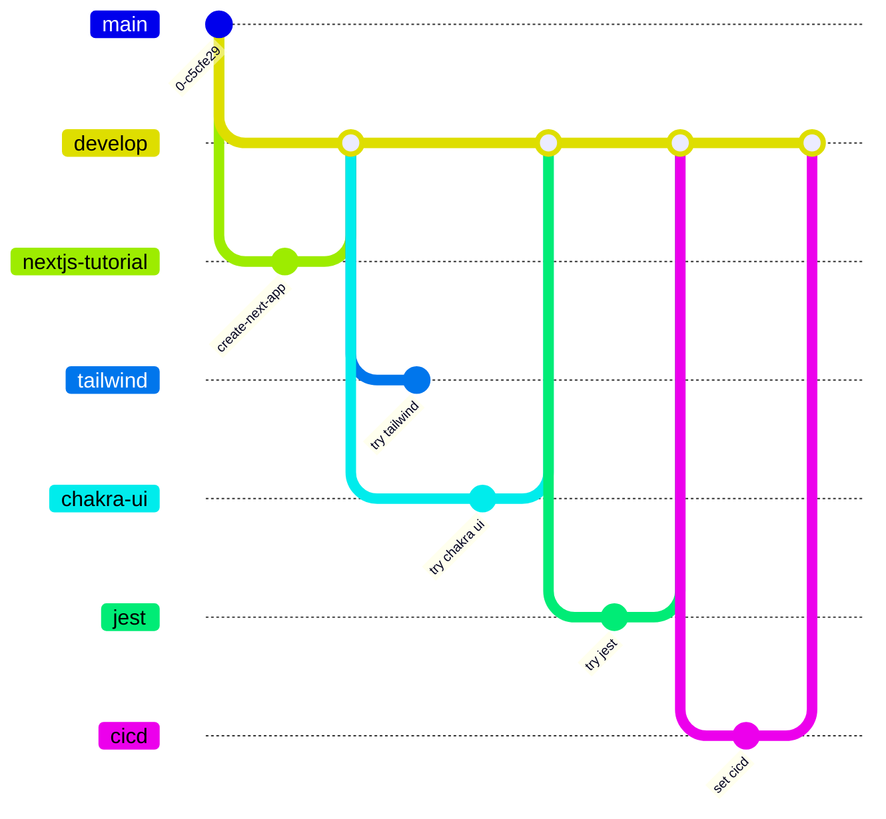
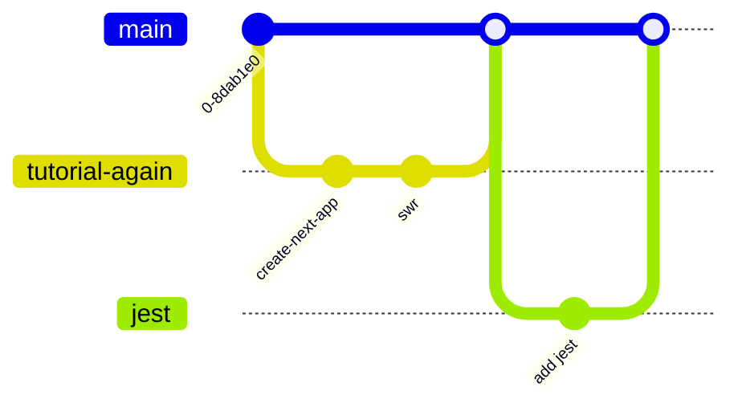

## やりたいこと
- typescript
- eslint, pretter
- swr
- prisma
- vercelデプロイ
- pathpida
- athpida
- jest
- cicd
- sentry

## 知りたいこと
- next.jsについて、ディレクトリ構造を理解してどこに何を追加するのか理解する
- 一通りわからないことがないくらいになりたい。
## 今回は勉強しないこと（別の機会にすること）
- [[React Server Component|RSC]]
- レンダリングストラテジー（静的、動的、Streaming）

## app router tutorial(途中まで)
### 実装戦略
- app router
- chakra ui
- (tailwind)
- サーバーサイドはfirebase
### ブランチ戦略
- ~~tailwindリポジトリ~~
- ~~chakra ui リポジトリ~~
- next.js tutorial
	- tailwindブランチ
	- chakra uiブランチ
- fullstack next.jsは別リポジトリ？

### メモ
`/app`: app routerのディレクトリ。ファイルの配置でルーティングが決まる。
`/app/lib`: 関数など
`/app/ui`: UIコンポーネント
`/app/**/page.tsx`: ルーティング対象のページファイル
`/app/**/layout.tsx`: page.tsxをラップするレイアウトファイル
`/public`: 静的アセット
`next.config.mjs(js)`:next.jsの設定ファイル

Placeholder data
	JSONフォーマットかJavaScriptオブジェクトで定義するモックデータ。データベースやAPIが用意できてない時など。

`global.css`はアプリケーション内のすべてのコンポーネントに適応される。`/app/layout.tsx`でインポートすることを推奨している。
module cssを使うことでコンポーネントごとの小さなスコープでスタイリングを定義できる
状態によってスタイリングを分岐する場合には`clsx`を使う
また、[[sass]]を使ったり[[CSS-in-JS]]ライブラリを使用するのも良い。

`/app/ui/fonts.ts`でフォントの定義をして、page.tsxなどで呼び出して使用する。フォントファイルをクライアントサイドにダウンロードさせずにサーバーサイドで適応できるためパフォーマンスの最適化につながる。

画像の表示には`next/image`コンポーネントの[[<Image>]]タグを使うと自動で最適化してくれる。

`page.tsx`はReact componentをエクスポートする特別なファイルであり、`/app`直下に配置しなければならない。`http://localhost:3000/`でこのファイルのページが表示される。

セグメント内で共通構造を共有するにはlayoutとtemplateがある。layoutの場合はlayoutインスタンスを共有するのに対してtemplateはインスタンスを共有しない。なのでlayoutはフェッチデータが引き継がれるがtemplateは引き継がない、また`useEffect()`がlayoutでは発火しないがtemplateでは発火するという違いがある

ルートレイアウトで`<head>`タグを追加するのではなく、Metadata APIを使用する方がいい

ページ遷移
	- `<Link>`コンポーネント
	- `useRouter`フック
	- ネイティブHistory API

## pages router tutorial
### 実装戦略
react tutorial
- pages router
- chakra ui
- swr
- typescript

### メモ
pages routerなので`/pages`配下にコードを書く
ルートコンポーネントは`pages/index.tsx`
ディレクトリ構成がルーティングになる
	`pages/posts/first-post.tsx`→`/posts/first-post`
[[<Link>]]コンポーネントでリンクを作る
静的アセットは`/public`に配置する
[[<Image>]]コンポーネントで画像を配置する
[[<Head>]]コンポーネントでメタデータを記述する
サードパーティjavascriptは[[<Script>]]コンポーネントで記述する
`pages/_app.tsx`はすべてのページをラップしている。ページ間での状態維持やグローバルスタイルの追加をする時に使う
Next.jsではデフォルトとして[[Next.js Pre-rendering|Pre-rendering]]でページを生成する。クライアントサイドJavaScriptで生成するのではなく、あらかじめ生成しておくことであり、パフォーマンスとSEOの向上になる。
Next.jsでは生成されたHTMLに最小限のJavaScriptコードが関連付けられており、ページがブラウザによってロードされるとJavaScriptコードが実行され、ページを完全にインタラクティブにする。(このプロセスは[[hydration]]という)
![[スクリーンショット 2024-07-19 9.56.38.png]]
Next.jsのプリレンダリングには[[スタティックサイトジェネレーション|Static Site Generation]]と[[サーバーサイドレンダリング|Server Side Rendering]]の2種類ある。SSGはビルド時にHTMLを生成するのに対して、SSRはリクエスト時にHTMLを生成する違いがある。
Next.jsではページごとにレンダリング形式を選ぶことができる
