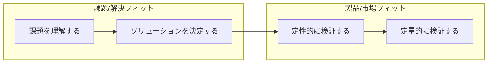

---
tags:
  - book
  - lean
  - ProductManagement
---
## なぜ読むのか
- リリース済みのサービスに対して[[プロダクトマネジメント]]を実践する方法を知りたいので
- [[リーンキャンバス]]の使い方を学ぶため

## 主題
[[Lean Startup]]を実践に落とし込むポイントを紹介する
### 第1部 ロードマップ
プロセスの全体像
#### 手順1:プランAを文書化する
リーンキャンバスを描いてビジネスモデルの全体像を掴む。ソリューションがプロダクトなのではなく、ビジネスモデル全体がプロダクトだと捉えて、各要素をうまくまとめる。
#### 手順2:プランで最もリスクの高い部分を見つける 
スタートアップには3つのステージがある
1. 課題/解決フィット(Problem/Solution Fit)
	解決に値する課題を見つける
2. 製品/市場フィット(Product/Market Fit)
	課題を解決しうる十分なものを構築する
3. 拡大(Scale)
	成長を加速させる

> 製品/市場フィット前は、**学習と[[ピボット]]**に集中します。製品/市場フィット後は、**成長と最適化**に集中が移動します。

リーンキャンバスからリスクの高い部分を抽出して優先順位をつける。優先順位の高いものからテストしていく。

> 最も学習できるのは、期待する成果の見込みが50%の時です。つまり、何が期待できるのかよくわからない時です。

期待する成果が小さいなら学習する価値がないので手をつけない。

> 資金調達に適した時期は製品/市場フィット後です。
#### 手順3:プランを体系的にテストする
リスクの高い部分をユーザーインタビューやモックアップなどで計測し、学習する。

上記それぞれのステップで学習を実施する
### 第2部 プランAを文書化する
リーンキャンバスで文書化する
以下の順番で埋めていき、ビジネスモデルの全体像を掴む。
1. 課題
2. 顧客セグメント
3. UVP
4. ソリューション
5. チャネル
6. 収益の流れ
7. コスト構造
8. 主要指標
9. 圧倒的な優位性
### 第3部 プランで最もリスクの高い部分を見つける
リーンキャンバスから、ビジネスのリスクを洗い出す
### 4章 ビジネスモデルの優先順位
スタートアップのリスクは３種類
- 製品リスク
	- 課題、ソリューション、UVP、主要指標に対応する
- 顧客リスク
	- 顧客セグメント、チャネルに対応する
- 市場リスク
	- 収益の流れ、コスト構造、既存の代替品、圧倒的な優位性に対応する
リスクの高いところから優先順位をつけてリストにする。リスク評価には外部の意見も参考にする。
リーンキャンバスを比較して、十分に大きな市場を持ち、製品の周りにビジネスを構築でき、その製品を必要とする顧客にアクセスしやすいビジネスモデルを見つけ出す。
### 5章 実験の準備
- [[Minimum Viable Product|MVP]]の検証チームは3人以下
- 開発、デザイン、マーケティングを考慮できること
- 高速かつ集中して学習サイクルを回せること
- 仮説は反証可能な文にすること
- スタートアップの3つのリスクそれぞれについて4つのステップで検証する
	1. 課題理解
		- ユーザーインタビュー、観察を実施する
		- 解決に値する課題か
		- 誰が課題を感じているか
		- 現時点ではどのように解決されているか
	2. ソリューションの決定
		- デモを作って顧客に見せてテストする
		- うまくいくか
		- アーリーアダプターは誰か
		- 価格は受け入れられるか
	3. 定性的に検証
		- MVPをアーリーアダプターに見てもらう
		- UVPに気づいてもらえるか
		- 他のアーリーアダプターにどうすればリーチできるか
		- 料金を払ってもらえるか
	4. 定量的に検証
		- より多くの人たちに見てもらう
		- 主要指標は満たせているか
		- より広範囲の顧客にリーチできるか
		- 利益は出ているか

### 第4部 プランを体系的にテストする
4つのステージからなるプロセスの概要を説明し、プランの有効性をテスト、修正していく
### 6章 顧客インタビューの準備
インタビューのコツ
- 顧客の課題を正しく理解することを目的にする
- 顧客も欲しい機能はわからない。行動を観察する
- 台本を用意する
- 最初はいろんな顧客にインタビューする。アーリーアダプターの絞り込みは後。
- 直接面会すること
- 知り合いから始めること
- 誰かと一緒にすること
- 気楽にできる場所ですること
- ゆっくり30分程度
- 謝礼はしない。お金を払ってくれる顧客を見つけることが目的だから。
- 録音しない。観察者のバイアスがかかってしまう。
- インタビュー後にすぐに文書化する
- 30人〜60人にインタビューする
- スケジュール調整は時間の無駄なので効率化する
見込み客の探し方
- 将来使うチャネルで探せるとベスト
- ターゲットになりうる知り合い
- 知り合いの紹介
- 親近感を持ってもらえるように工夫する
- 予告ページでメールアドレスを登録してもらう
- 記事、ブログ、動画などにして使わせてもらう
- 電話、メール、LinkedInなど
### 7章 課題インタビュー
- 解決に値する課題か
- 誰が課題を感じているか
- 現時点ではどのように解決されているか

### 8章 ソリューションインタビュー
### 9章 MVPリリース
### 10章 計測の準備
### 11章 MVPインタビュー
### 12章 顧客ライフサイクルの検証
### 13章 運用中のプロダクトマネジメント
### 14章 PMFの計測

