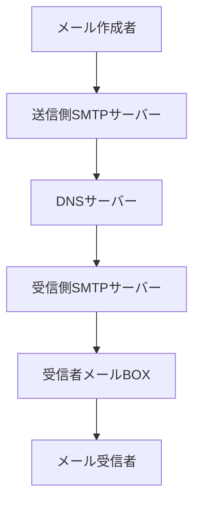

---
tags:
  - プロトコル
  - メール
aliases:
  - Simple mail Transfer Protocol
---
メール送信する際に使われるプロトコル。ポート番号は25。

```mermaid
flowchart TD
    A[メール作成者] --> B[送信側SMTPサーバー]
    B --> C[DNSサーバー]
    C --> D[受信側SMTPサーバー]
    D --> E[受信者メールBOX]
    E --> F[メール受信者]

```
