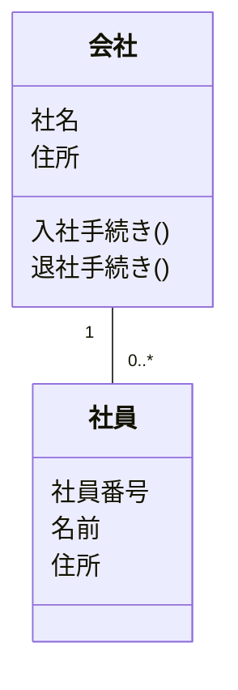
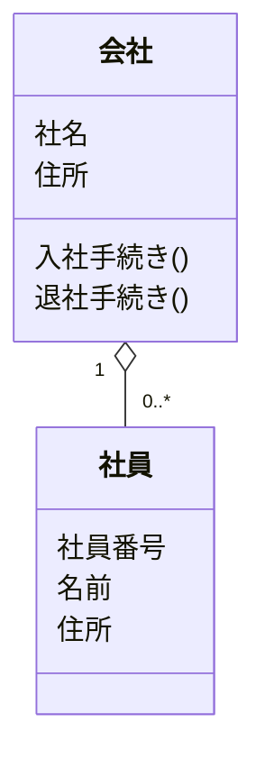

[[Unified Modeling Language|UML]]のひとつで、クラスの定義やクラス同士の関係を表現した図
数字は多重度を表す。

## 関連(Association)
あるクラスが他のクラスのオブジェクトを保持すること。

```mermaid
classDiagram

class 社員 {
社員番号
名前
住所
}

class 会社 {
社名
住所
入社手続き()
退社手続き()
}

会社 "1" -- "0..*" 社員
```
## [[集約]](Aggregation)
あるクラスが他のクラスを保持し、それらが全体-部分の関係を持つこと

```mermaid
classDiagram

class 社員 {
社員番号
名前
住所
}

class 会社 {
社名
住所
入社手続き()
退社手続き()
}

会社 "1" o-- "0..*" 社員
```
