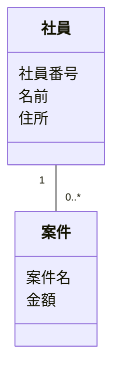
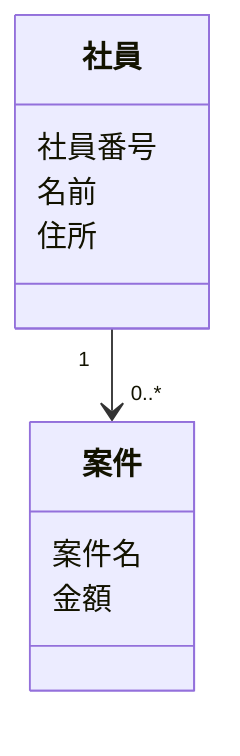
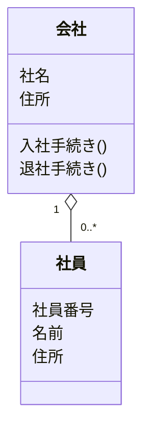
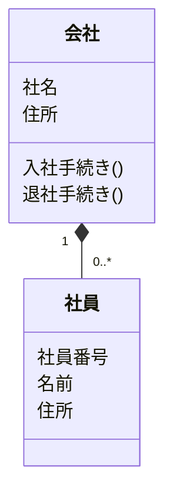
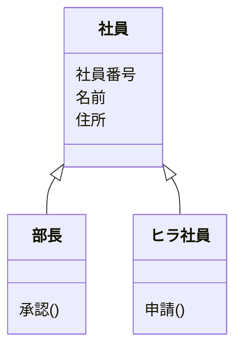

[[Unified Modeling Language|UML]]のひとつで、クラスの定義やクラス同士の関係を表現した図
数字は多重度を表す。
## 関連(Association)
あるクラスが他のクラスのオブジェクトを保持すること。

誘導可能性(navigability)は矢印で表現する。

## [[集約]](Aggregation)
二つのクラスが関連の関係にあり、それらが全体-部分の関係を持つこと
`has-a`の関係

## コンポジション(Composition)
二つのクラスが集約の関係にあり、ライフサイクルも同じ場合。

## [[汎化]]
一方のクラス（スーパークラス）ともう一方のクラス（サブクラス）の間に継承構造があること。
`is-a`の関係

