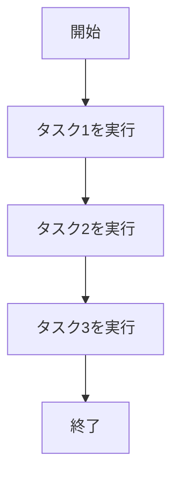

プログラムが1つの[[スレッド]]で処理を行う方式。
処理がシンプルで管理しやすいため、同期処理に適している。
一部の処理に時間がかかると全体が遅延するため、処理効率は悪い。

```mermaid
flowchart TD
    Start[開始] --> Task1[タスク1を実行]
    Task1 --> Task2[タスク2を実行]
    Task2 --> Task3[タスク3を実行]
    Task3 --> End[終了]

```

