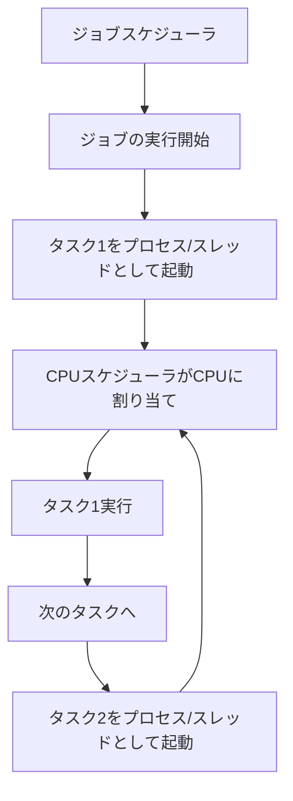

OSが[[ジョブ]]を細かく分割したもの。OSの下で実行される内部処理の単位。
タスクは[[プロセス]]、[[スレッド]]として起動する。

```mermaid
flowchart TD
    A[ジョブスケジューラ] --> B[ジョブの実行開始]
    B --> C[タスク1をプロセス/スレッドとして起動]
    C --> D[CPUスケジューラがCPUに割り当て]
    D --> E[タスク1実行]
    E --> F[次のタスクへ]
    F --> G[タスク2をプロセス/スレッドとして起動]
    G --> D
```