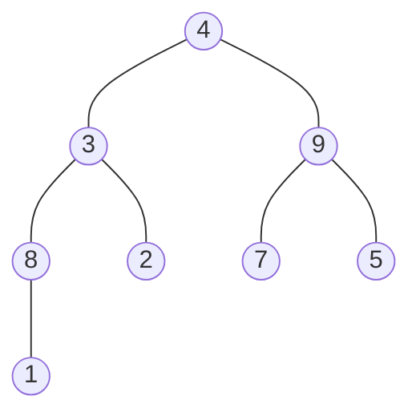
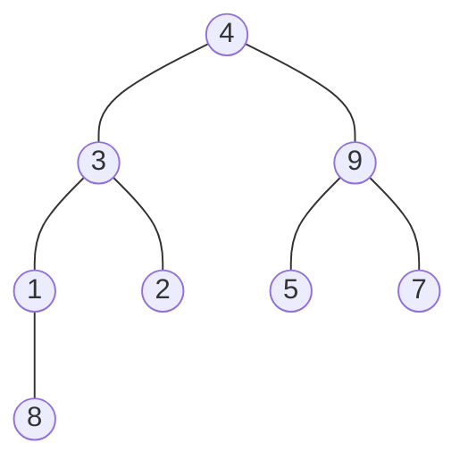
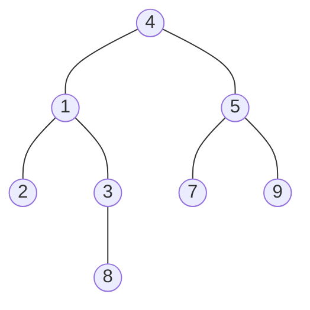
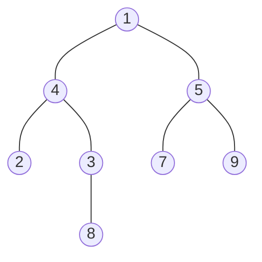
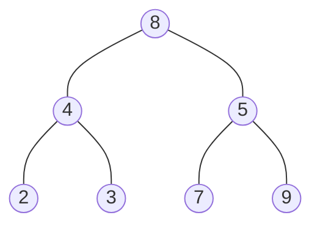

---
tags:
  - アルゴリズム
---
データを[[木構造]]で保持させて、それをヒープ木になるように並べ替える。完成したらルートの値を配列に戻し、同様の処理を繰り返して整列させる。
1. 配列から木構造を作る
	\[4, 3, 9, 8, 2, 7, 5, 1]

2. 親<子になるようにリーフ側から並べ替える

※mermaidのレンダリングの影響で左端が2になってるが本当は3-8が左端

3. ルートの値を配列に取り出す
4. 左端または右端のリーフをルートにして2, 3を繰り返す
	※左端は8

