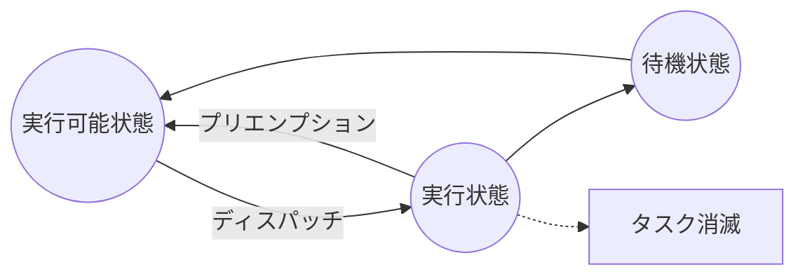

---
aliases:
  - プリエンプション
---
- マルチタスクのコンピュータシステムが実行中のタスクを一時的に中断しながら、別のタスクにCPUを割り当てて処理を行う方式
- また、実行状態から実行可能状態に戻すことをプリエンプションという

```mermaid
graph LR

Ready((実行可能状態))
Executing((実行状態))
Waiting((待機状態))
Done[タスク消滅]

Ready --ディスパッチ--> Executing
Executing --プリエンプション--> Ready
Executing --> Waiting
Waiting --> Ready
Executing -.-> Done
```

