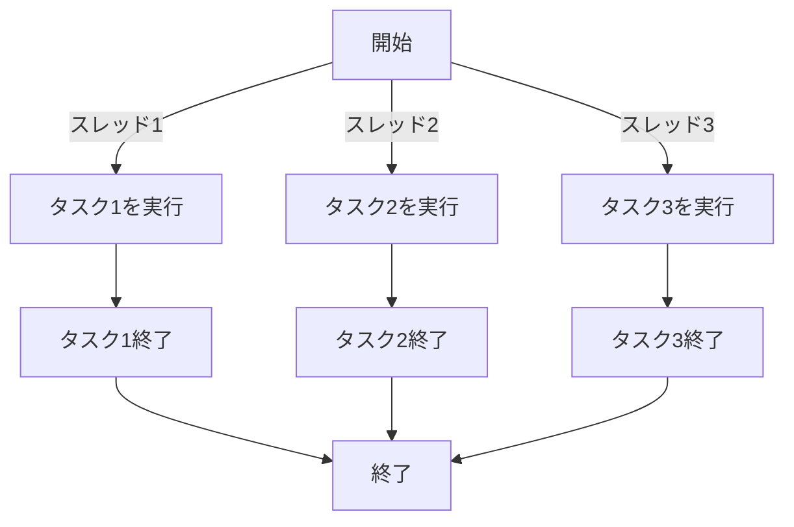

1つのプログラムの中で複数の[[スレッド]]を同時に実行する方式。
[[並列処理]]や時間のかかるタスクを効率よく実行できる。
スレッド間でリソース（メモリやファイル）を共有するため、競合やデッドロック、データの整合性に注意が必要。

```mermaid
flowchart TD
    Start[開始] -->|スレッド1| Task1[タスク1を実行]
    Start -->|スレッド2| Task2[タスク2を実行]
    Start -->|スレッド3| Task3[タスク3を実行]
    
    Task1 --> Task1_End[タスク1終了]
    Task2 --> Task2_End[タスク2終了]
    Task3 --> Task3_End[タスク3終了]
    
    Task1_End --> End[終了]
    Task2_End --> End
    Task3_End --> End

```
