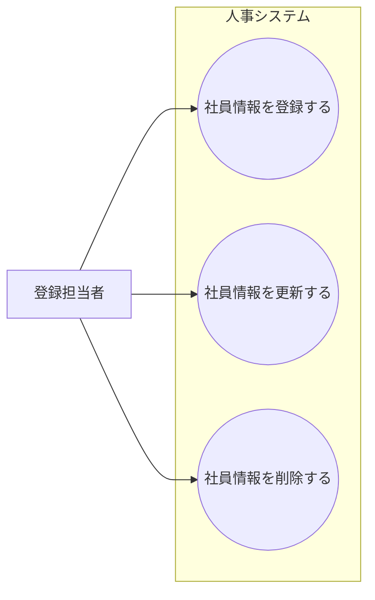

[[Unified Modeling Language|UML]]のひとつで、ユーザー視点で「このシステムではこんなことができる」という要件を示した図

```mermaid
graph LR
A[登録担当者] --> B((社員情報を登録する))
A --> C((社員情報を更新する))
A --> D((社員情報を削除する))

subgraph 人事システム
	B
	C
	D
end
```
