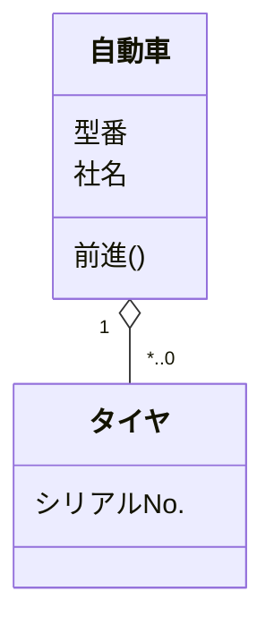

---
aliases:
  - Aggregation
---
下位クラスが集まって上位クラスが構成されるていること。
has-aの関係

逆は分解
is_part_ofの関係

自動車 has- a タイヤ
タイヤ is_part_of 自動車

```mermaid
classDiagram

class タイヤ {
シリアルNo.
}

class 自動車 {
型番
社名
前進()
}

自動車 "1" o-- "*..0" タイヤ
```
